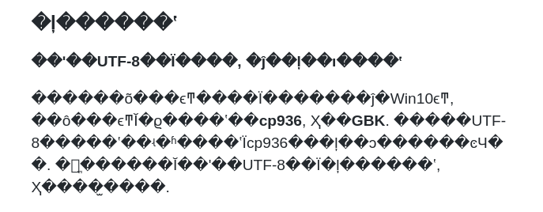
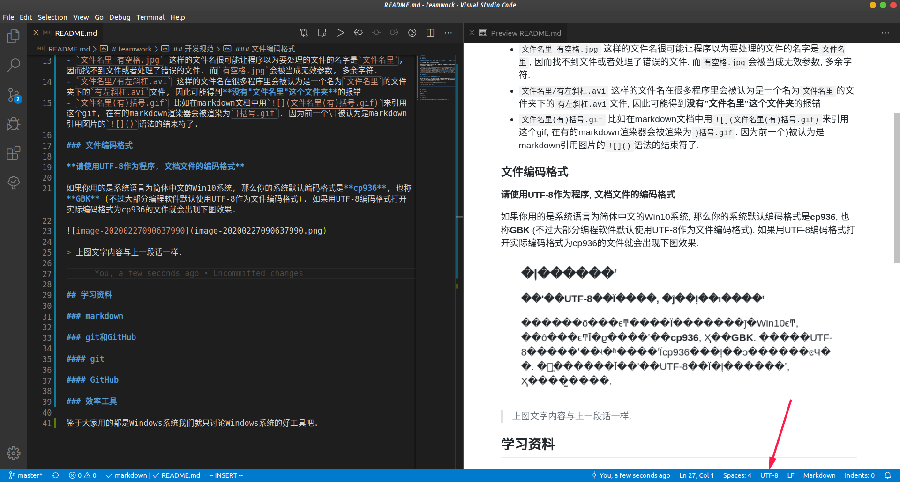

# teamwork

## 开发规范

### 文件命名

**文件名只应包含数字, 字母, 汉字, 下划线 ( _ ), 连字符 ( - ), 句点 ( . )**

💡 空格以下划线代替, 其他字符以连字符代替.

文件名包含其他字符容易导致程序出错. 为避免麻烦我们以这样的形式规范命名文件. 文件名包含其他字符可能造成的问题举例:

- `文件名里 有空格.jpg` 这样的文件名很可能让程序以为要处理的文件的名字是`文件名里`, 因而找不到文件或者处理了错误的文件. 而`有空格.jpg`会被当成无效参数, 多余字符.
- `文件名里/有左斜杠.avi` 这样的文件名在很多程序里会被认为是一个名为`文件名里`的文件夹下的`有左斜杠.avi`文件, 因此可能得到**没有"文件名里"这个文件夹**的报错
- `文件名里(有)括号.gif` 比如在markdown文档中用`括号.gif)`来引用这个gif, 在有的markdown渲染器会被渲染为`)括号.gif`. 因为前一个\)被认为是markdown引用图片的``语法的结束符了.

### 文件编码格式

**请使用UTF-8作为程序, 文档文件的编码格式**

如果你用的是系统语言为简体中文的Win10系统, 那么你的系统默认编码格式是**cp936**, 也称**GBK** (不过大部分编程软件默认使用UTF-8作为文件编码格式). 如果用UTF-8编码格式打开实际编码格式为cp936的文件就会出现下图效果.

> 上图文字内容与上一段话一样.

> 如果你使用Visual Studio Code, 在状态栏里可以看到当前文件是以什么编码格式打开的. 点击它可以更改当前文件保存/读取时使用的编码格式.

🔗 [了解更多关于cp936](https://leojhonsong.github.io/zh-CN/2019/05/29/%E6%9C%89%E5%85%B3%E5%AD%97%E7%AC%A6%E9%9B%86%E4%B8%8E%E7%BC%96%E7%A0%81/#%E8%87%AA%E6%95%B4%E7%90%86%E7%9A%84%E4%B8%AD%E6%96%87%E5%AD%97%E7%AC%A6%E9%9B%86%E5%8F%91%E5%B1%95%E5%8F%B2)

## 学习资料

为方便大家了解各自在做什么, 相互学习, 方便后期报告写作, 我们把看到的好的相关资料整理到这里吧.

### markdown

你目前看到的这份文档就是一个markdown文件😏

因此markdown算是我们沟通的一大关键, 请大家学习一下🙏

🔗 [markdown教程](https://leojhonsong.github.io/zh-CN/2019/09/23/Markdown%E5%AE%89%E5%88%A9-Typora%E7%AE%80%E8%A6%81%E4%BD%BF%E7%94%A8%E6%95%99%E7%A8%8B/)

### git和GitHub

[详情](git和github.md)

### 文档驱动开发

🔗 [Readme Driven Development](https://tom.preston-werner.com/2010/08/23/readme-driven-development.html)

### ssh

小车在线调试前期远程连接小车的方式. 因为主板打算采用树莓派4, 因此只需要让树莓派和电脑在同一个WiFi下就可以通过访问树莓派ip来ssh连接. (树莓派自身开启热点/手机热点)

[详情](ssh.md)

### 效率工具

鉴于大家用的都是Windows系统我们就只讨论Windows系统的好工具吧.

[详情](效率工具.md)