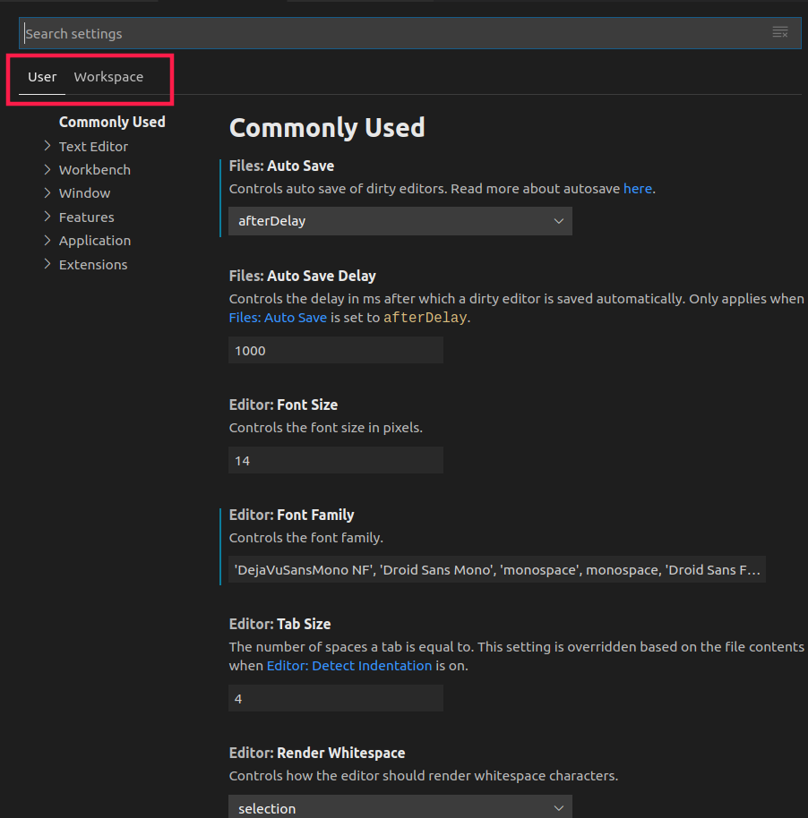
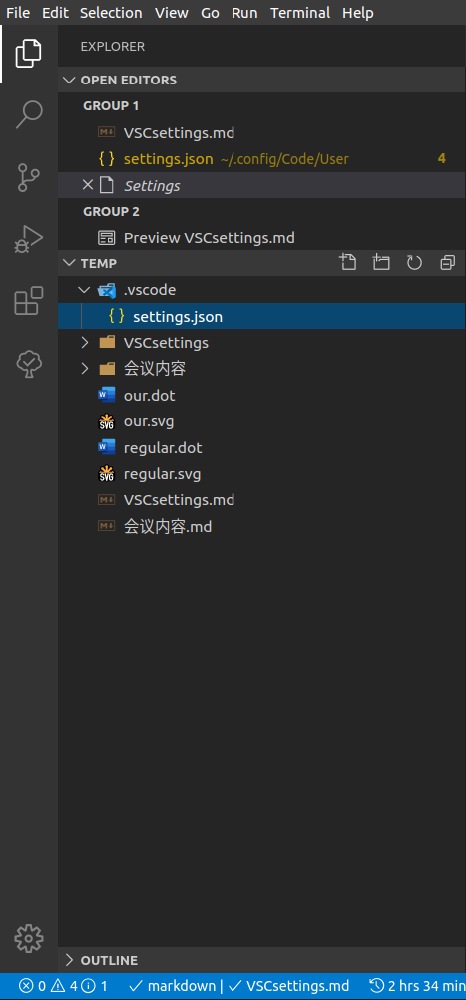
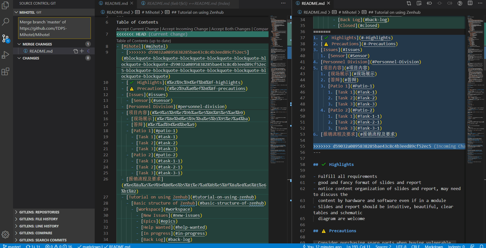
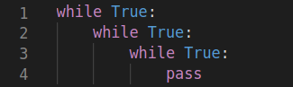
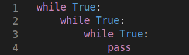
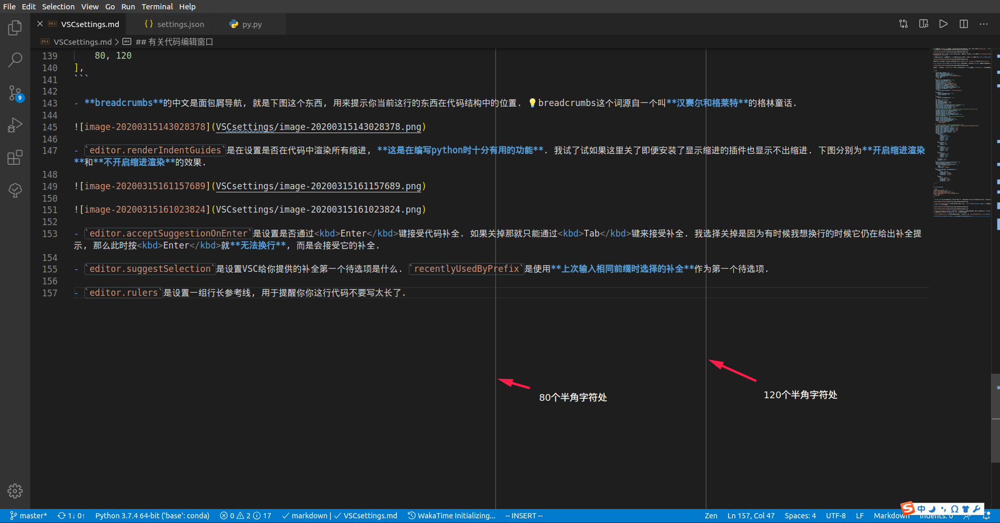

通过编辑VSC的`settings.json`就可以轻松更改VSC本体以及各插件的设置, 参数. 在VSC中有两级`settings.json`, 一个是**User**级 (全局), 一个是**Workspace**级 (仅针对某一个文件夹). 在图形形式的设置中通过下图两个地方来切换设置User级设置还是Workspace级设置.



Workspace级设置实际是通过你当前工作区 (就是你用VSC打开的文件夹) 根目录的`.vscode`文件夹里一个`settings.json`来记录的. **也就是说工作区根目录的`settings.json`的设置会覆盖全局`settings.json`中对应设置.**



💡 这种方式的好处是一个团队可以通过使用同样的settings.json来在一个项目中使用同样的配置, **即便每个人的相关项的全局设置可能并不同**.

> 团队成员使用的设置不同导致的问题的一个例子: 左侧窗口和右侧窗口的内容区别本应该只有目录的新增部分, 但因为褚进炜使用的设置是**目录为无序列表**而我使用的设置是**目录为有序列表**所以整个列表都有了更改



下面我分享一部分我的全局settings.json的内容及其含义 (在VSC中打开全局`settings.json`或者工作区`settings.json`鼠标放到变量名上会有对该变量的简短解释)

💡 按 <kbd>Ctrl</kbd><kbd>shift</kbd><kbd>P</kbd>打开VSC的命令面板, 然后输入**settings**, 你就会看到下面这个选项了 (如果你最近用过这个命令你就可以在历史命令里看到它)


我先把精简过的我的全局`settings.json`放在这里, 可以直接粘贴**其中内容**到你全局`settings.json`中 (别连最外面的大括号一起复制了😂), 如果你有兴趣可以看后面的每个设置的含义来选择你要设置哪些.

❗️以`// `开头的是注释掉的设置, 是需要你们根据程序在自己电脑上位置来改一下的.

1. [有关代码编辑窗口](#有关代码编辑窗口)
2. [有关工作台](#有关工作台)
3. [语言特定设置](#语言特定设置)
4. [有关git](#有关git)
5. [有关LaTex Workshop](#有关LaTex-Workshop)
6. [有关markdown](#有关markdown)
7. [有关python](#有关python)
8. [有关Todo Tree](#有关Todo-Tree)

```json
{
    "files.autoSave": "afterDelay",
    "editor.renderIndentGuides": true,
    "editor.acceptSuggestionOnEnter": "off",
    "editor.suggestSelection": "recentlyUsedByPrefix",
    "editor.rulers": [
        80, 120
    ],
    "explorer.confirmDragAndDrop": false,
    "explorer.confirmDelete": false,
    "workbench.iconTheme": "vscode-icons",
    "workbench.editor.tabCloseButton": "left",
    "workbench.list.openMode": "doubleClick",
    "workbench.list.horizontalScrolling": true,
    "workbench.settings.openDefaultSettings": false,
    "workbench.startupEditor": "none",
    "[markdown]": {
        "editor.quickSuggestions": true,
        "editor.wordWrap": "on",
    },
    "[json]":{
        "editor.quickSuggestions": true,
    },
    // "git.path": "C:/Users/LeoJh/Softwares/Git/bin/git.exe",
    "git.autofetch": true,
    "git.enableSmartCommit": true,
    "merge-conflict.autoNavigateNextConflict.enabled": true,
    "gitlens.codeLens.enabled": true,
    "gitlens.views.repositories.location": "scm",
    "gitlens.views.fileHistory.location": "scm",
    "gitlens.views.lineHistory.location": "scm",
    "gitlens.views.compare.location": "scm",
    "gitlens.views.search.location": "scm",
    "gitlens.menus": {
        "editor": {
            "blame": false,
            "clipboard": false,
            "compare": true,
            "details": false,
            "history": false,
            "remote": false
        },
        "editorGroup": {
            "blame": true,
            "compare": true
        },
        "editorTab": {
            "clipboard": false,
            "compare": false,
            "history": false,
            "remote": false
        },
        "explorer": {
            "clipboard": true,
            "compare": true,
            "history": false,
            "remote": true
        },
        "scmGroup": false,
        "scmItem": false
    },
    "latex-workshop.latex.autoBuild.run": "never",
    "latex-workshop.view.pdf.viewer": "tab",
    "latex-workshop.chktex.enabled": true,
    // "latex-workshop.chktex.path": "C:/Users/LeoJh/Softwares/texlive/2018/bin/win32/chktex.exe",
    "markdown.extension.print.absoluteImgPath": false,
    "markdown.extension.toc.orderedList": true,
    "markdown.extension.toc.levels": "2..6",
    "markdown.extension.toc.downcaseLink": false,
    "markdown.extension.toc.githubCompatibility": true,
    "path-autocomplete.triggerOutsideStrings": true,
    // "python.pythonPath": "C:/Users/LeoJh/Softwares/Anaconda3/python.exe",
    // "python.condaPath": "C:/Users/LeoJh/Softwares/Anaconda3/Scipts/conda.exe",
    "python.jediEnabled": false,
    "python.linting.enabled": true,
    "python.linting.pylintEnabled": false,
    "python.linting.pycodestyleEnabled": true,
    "python.linting.pycodestyleArgs": [
        "--max-line-length=120",
        "--ignore=E402"
    ],
    "vsintellicode.modify.editor.suggestSelection": "automaticallyOverrodeDefaultValue",
    "todo-tree.highlights.defaultHighlight": {
        "icon": "file-directory",
        "type": "text",
        "iconColour": "#dcb67a"
    },
    "todo-tree.highlights.customHighlight": {
        "TODO": {
            "icon": "check",
            "foreground": "#fff",
            "background": "#ff8000",
            "iconColour": "yellow"
        },
        "FIXME": {
            "icon": "alert",
            "foreground": "#fff",
            "background": "red",
            "iconColour": "red"
        }
    },
}
```

## 有关代码编辑窗口

```json
"files.autoSave": "afterDelay",
"editor.renderIndentGuides": true,
"editor.acceptSuggestionOnEnter": "off",
"editor.suggestSelection": "recentlyUsedByPrefix",
"editor.rulers": [
    80, 120
],
```

🔗 [VSC官方对用户界面各区域命名及介绍](https://code.visualstudio.com/docs/getstarted/userinterface)

- `editor.renderIndentGuides`是在设置是否在代码中渲染所有缩进, **这是在编写python时十分有用的功能**. 我试了试如果这里关了即便安装了显示缩进的插件也显示不出缩进. 下图分别为**开启缩进渲染**和**不开启缩进渲染**的效果.





- `editor.acceptSuggestionOnEnter`是设置是否通过<kbd>Enter</kbd>键接受代码补全. 如果关掉那就只能通过<kbd>Tab</kbd>键来接受补全. 我选择关掉是因为有时候我想换行的时候它仍在给出补全提示, 那么此时按<kbd>Enter</kbd>就**无法换行**, 而是会接受它的补全.

- `editor.suggestSelection`是设置VSC给你提供的补全第一个待选项是什么. `recentlyUsedByPrefix`是使用**上次输入相同前缀时选择的补全**作为第一个待选项.

- `editor.rulers`是设置一组行长参考线, 用于提醒你你这行代码不要写太长了. 不过markdown不算需要注意行长的语言😏



## 有关工作台

💡 工作台就是整个VSC界面

```json
"explorer.confirmDragAndDrop": false,
"explorer.confirmDelete": false,
"workbench.iconTheme": "vscode-icons",
"workbench.editor.tabCloseButton": "left",
"workbench.list.openMode": "doubleClick",
"workbench.list.horizontalScrolling": true,
"workbench.settings.openDefaultSettings": false,
"workbench.startupEditor": "none",
```

- `explorer.confirmDragAndDrop`和`explorer.confirmDelete`分别设置你在直接从Windows的资源管理器拖动文件或文件夹到VSC侧边栏的资源管理器面板时不弹出确认弹窗, 在从VSC的资源管理器删除文件时不弹出确认弹窗.

- `workbench.iconTheme`是设置VSC的资源管理器里的各种文件夹和文件的图标主题. 我最喜欢的是这个[vscode-icons](https://marketplace.visualstudio.com/items?itemName=vscode-icons-team.vscode-icons), 因为我感觉这个的图标最全而且比较好看. 💡你可以直接在侧边栏的**插件市场**安装你喜欢的图标主题.

- `workbench.editor.tabCloseButton`设置关闭代码编辑窗口的那个❌在左边还是右边. 我喜欢设置在左边, 这样如果开了很多窗口时也不会出现关闭按钮被遮住了的情况.

- `workbench.list.horizontalScrolling`是设置侧边栏了树状结构和列表是否支持水平滑动

- `workbench.startupEditor`设置如果上次关闭VSC时所有窗口都已经关闭了下次打开时显示什么界面. **默认显示的是欢迎界面**.

## 语言特定设置

```json
"[markdown]": {
    "editor.quickSuggestions": true,
    "editor.wordWrap": "on",
},
"[json]":{
    "editor.quickSuggestions": true,
},
```

VSC支持设置只在特定**语言的文件中生效**的设置. 比如这个地方的两个设置. 在默认设置中VSC通过语言特定设置禁用了在**markdown**和**json**这两种语言中的部分补全功能, 这里就再开启.

而`editor.wordWrap`设置当一行超出代码编辑窗口边界时的处理方式. 设置为**on**是将超出部分在编辑窗口边界处折行.

## 有关git

```json
// "git.path": "C:/Users/LeoJh/Softwares/Git/bin/git.exe",
"git.autofetch": true,
"git.enableSmartCommit": true,
"git.postCommitCommand": "push",
"merge-conflict.autoNavigateNextConflict.enabled": true,
"gitlens.codeLens.enabled": true,
"gitlens.views.repositories.location": "scm",
"gitlens.views.fileHistory.location": "scm",
"gitlens.views.lineHistory.location": "scm",
"gitlens.views.compare.location": "scm",
"gitlens.views.search.location": "scm",
"gitlens.menus": {
    "editor": {
        "blame": false,
        "clipboard": false,
        "compare": true,
        "details": false,
        "history": false,
        "remote": false
    },
    "editorGroup": {
        "blame": true,
        "compare": true
    },
    "editorTab": {
        "clipboard": false,
        "compare": false,
        "history": false,
        "remote": false
    },
    "explorer": {
        "clipboard": true,
        "compare": true,
        "history": false,
        "remote": true
    },
    "scmGroup": false,
    "scmItem": false
},
```

- `git.autofetch`设置VSC自动从默认远程段刷新, 确保时刻掌握本地和远程段同步情况.

- `git.enableSmartCommit`开启**智能提交**, 即当没有*已暂存*更改时提交所有更改.

- `git.postCommitCommand`设置在提交之后的动作, 设置为push那每次提交后该提交会自动推送到远程段.

  💡 我以前喜欢利用上面两条来实现**一键三连**, 就是在源代码控制面板的**提交信息框**输入提交信息后按<kbd>Ctrl</kbd><kbd>Enter</kbd>, 然后VSC会自动将所有更改添加到本次提交, 然后自动推送到远程段, **一键完成add, commit, push**三步. 但是这样的坏处也正是一提交就会被推送到远程段, **不给你在本地版本回退的机会**. 比如你发现你之前的某一个提交有错误, 那么就需要`版本回退`. 对于个人使用的版本库这没有什么问题, 而对于多人版本库来说, 在你自己本地版本回退还没有推送的提交也就是一行命令的事, 但**远程段版本回退则是一件很麻烦的事** (你可以从[这篇文章](https://blog.csdn.net/fuchaosz/article/details/52170105)大致看出这有多麻烦). <span style="color:red;">因此在一个分支的代码高频迭代期间我完全不建议大家使用这个功能</span>

- `merge-conflict.autoNavigateNextConflict.enabled`设置是否在处理完一个冲突后自动跳转到下一个冲突处. 实际上**多人开发时遇到冲突是很常见的事**, 但别慌, 这事实际上很好处理, 你要做的事情就是: **判断在一个冲突处是保留你的更改还是保留来自远程段的更改还是都保留, 或者其他. 然后VSC自动为你跳转到下一个冲突处. 等决定完每一个冲突处的解决方式你就搞定它了!**

- 后面gitlens开头这一堆其实是**gitlens**这个插件的一些设置. 💡建议在命令面板输入`gitlens open settings`来打开gitlens提供的专门设置gitlens设置的界面, 那里对gitlens每一个设置的用途说明得很清楚, 而且是图形界面😏


## 有关LaTex Workshop

```json
"latex-workshop.latex.autoBuild.run": "never",
"latex-workshop.view.pdf.viewer": "tab",
"latex-workshop.chktex.enabled": true,
// "latex-workshop.chktex.path": "C:/Users/LeoJh/Softwares/texlive/2018/bin/win32/chktex.exe",
```

这几个是使用在VSC编辑LaTex使用的插件的设置. chktex是texlive自带的LaTex语法检查工具.

## 有关markdown

```json
"markdown.extension.print.absoluteImgPath": false,
"markdown.extension.toc.orderedList": true,
"markdown.extension.toc.levels": "2..6",
"markdown.extension.toc.downcaseLink": false,
"markdown.extension.toc.githubCompatibility": true,
```

- `markdown.extension.print.absoluteImgPath`设置将图片链接转为相对链接

- `markdown.extension.toc.orderedList`设置**生成的ToC为有序列表**而不是无序列表 (也就是前面提到的那个问题)

- `markdown.extension.toc.levels`设置目录包含哪些级别的标题, 此处没有包含一级标题, 也就是文档名, 这没意义.

- `markdown.extension.toc.downcaseLink`设置生成的目录的页内链接不要将各级标题转为全小写 (在有的地方这样会导致无法跳转)

- `markdown.extension.toc.githubCompatibility`设置开启GitHub兼容模式

## 有关python

```json
// "python.pythonPath": "C:/Users/LeoJh/Softwares/Anaconda3/python.exe",
// "python.condaPath": "C:/Users/LeoJh/Softwares/Anaconda3/Scipts/conda.exe",
"python.jediEnabled": false,
"python.linting.enabled": true,
"python.linting.pylintEnabled": false,
"python.linting.pycodestyleEnabled": true,
"python.linting.pycodestyleArgs": [
"--max-line-length=120",
"--ignore=E402"
],
"vsintellicode.modify.editor.suggestSelection": "automaticallyOverrodeDefaultValue",
```

- `python.jediEnabled`设置不使用jedi作为python的智能补全引擎

- `python.linting.enabled`和`python.linting.pylintEnabled`设置使用**pycodestyle**而不是**pylint**作为python的代码风格检查器 (linter)

- `python.linting.pycodestyleArgs`设置传递给pycodestyle的一些参数来微调代码风格检查的表现. 比如`--max-line-length=120`设置pycodestyle别在一行写到80字时就认为行长太长, 而是120字再说. `--ignore=E402`则是忽略E402这条: "模块引入语句需要在文件最开头"

  🔗 [中文版pycodestyle中对可用参数的说明](https://www.osgeo.cn/pycodestyle/intro.html#configuration) ❗️在这个链接跳转过去后的上面一点的绿框里😅

- `vsintellicode.modify.editor.suggestSelection`设置**intellicode**这个插件提供的补全提示和VSC自带的补全提示的合并方式.

## 有关Todo Tree

```json
"todo-tree.highlights.defaultHighlight": {
    "icon": "file-directory",
    "type": "text",
    "iconColour": "#dcb67a"
},
"todo-tree.highlights.customHighlight": {
    "TODO": {
        "icon": "check",
        "foreground": "#fff",
        "background": "#ff8000",
        "iconColour": "yellow"
    },
    "FIXME": {
        "icon": "alert",
        "foreground": "#fff",
        "background": "red",
        "iconColour": "red"
    }
},
```

这几个是设置Todo Tree面板里显示的的默认图标, 颜色, 以及对特定关键词显示的图标和颜色.