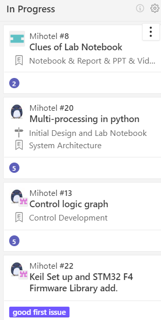
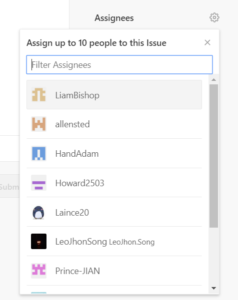

## Tutorial on using Zenhub

### Workspace
- ZenHub Workspaces are built using GitHub repositories. When a Workspace is created, each "card" on the Board represents a **GitHub Issue or Pull Request**.
- Move the cursor onto the **Workspace region** and slide the mouse wheel to **look through the tasks**.

#### New Issues
This workspace is created for **Newly created Issues** which requires to be done.

#### Epics
ZenHub Epics bundle **similar groups of Issues together**, providing a **visual progress bar** of work across related or dependent Issues. This panel can be regarded as a **group panel**, each group will have their own Epic panel containing their design tasks.

#### Help Wanted

The function of this workspace is exactly what it looks like. This panel contains the **problems which requires suggestions or solution from each member of Team Mihotel**.

#### In progress
This panel shows **what the team is currently working on**.

#### Back Log

- This panel contains the issues which **require to be solved immediately** or the **delayed ones**.

- The issues in Back-Log panel should **be placed by the order of their emergency levels**.

#### Closed

The **finished tasks** should be moved to this panel.

### Detailed panel operations

#### Establish new issues

This is the most basic and simple step to start our project management.
- New issues can be created by simply clicking on the green bond **New Issue** in the following picture.

⚠️Generally, team members are supposed to establish issues in Github. Zenhub is just a tool to help us have an eye on our project progress.

#### Panel setting up

This part is one of the most important step to do the project management which is related to the **division of team members** and the **project progress**. Therefore, in order to **develope the project systematically** and **finish the project on time**, it is necessary to learn how to set up the panel.

- The following figure is the panel setting up page, which will appear automatically as soon as the users click on **New Issues** bond.

##### How to import the content of the issue into the panel

As we can see here, the left part of the setting up page is the region for the content of the issue, including **Issue Title**, **Comment**, **Overview** and **File Attaching**.

- **Issue Title**

It is obvious that this region is for issue title.

- **Writing a comment & Attaching files**

This region is used for describing the detailed content of the issue, including **Issue content**, **Division of group members** and **The fils which are probably needed to solve the issue**.

- **Preview**

This region is used for **previewing what the panel is about to look like** so that **necessary adjustments can be done before pulling the panel to the pipe line**.

##### Setting of **Labels**

Issues can be divided into **several categories** as shown below. While setting the new issue, remind that **do not forget to mark the issue with labels** so that the team members are able to figure out what exactly category this issue belongs to. This can improve our efficiency.

  ##### How to **evolve the group members into the issue**.

This step is somehow similar to dividing tasks to group members. Als it can be regarded as the function of **@**. It can be simply achieved to evolve the group members by clicking the bond **Asignees** showed below.

##### How to evolve an issue into Epic.

This step is to **classify different issues**. As we have mentioned before, **Epic** is used to store similar or related issues. It is a good habit to classify the issues at the stage of developing an new issue. The newly established issue can be put into a proper Epic by clicking **Epics** bond shown below.

After Clicking **Epics** bond, the existing Epics will be shown immediately. Simply click the related Epic so that the new issue will be put into this Epic.

#### How to set the emergency level.

- Setting of **High Priority**

At the right part of the setting up page, there is a **pin shape bond**, **on the top**, which represents **Setting this issue as a high priority issue**.
The detailed bond is shown in the following picture.

- Except forHigh Priority, Issues can be moved freely in the pipe line. So the level of emergency can be simply set by moving issues freely in the pipe line.
