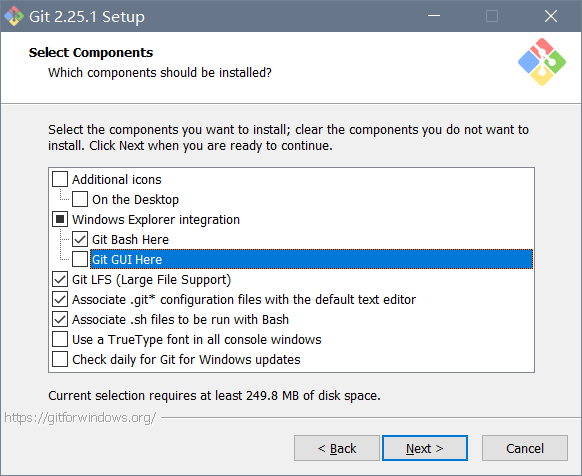
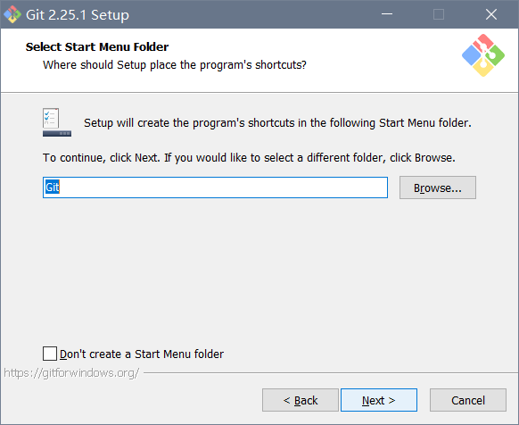
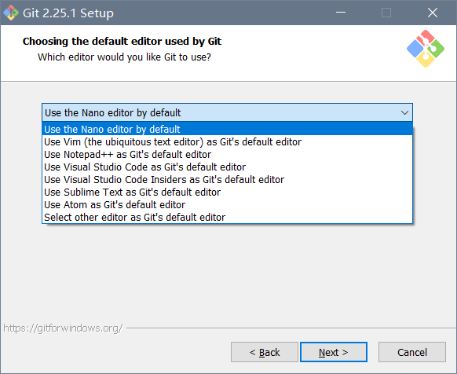
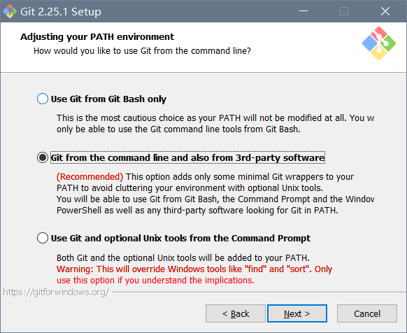
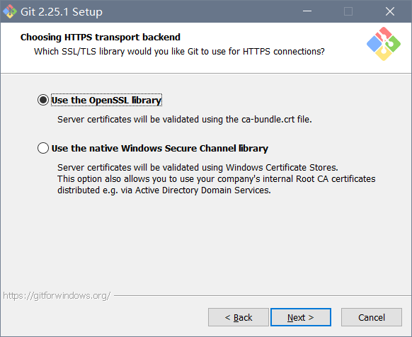
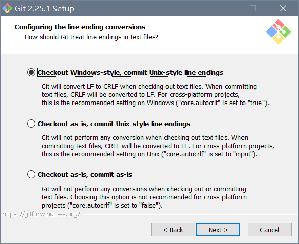
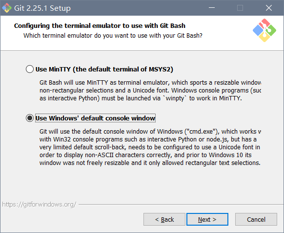
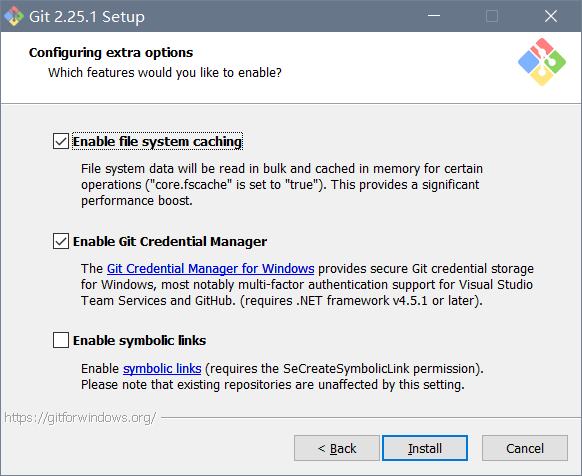

首先去[git官网](https://git-scm.com/downloads)下载安装包.

1. 先选个位置安装, 默认选项直到下图. 因为不怎么开git本身, 可以取消勾选这个GUI界面, 省得在右键菜单里碍眼.

2. 默认选项

3. 这个是在git命令行里提交时默认打开的编辑器. 虽然估计不会用到, 保险起见选一个最省事的nano.

4. 此处选择添加git到路径, 这样在Windows自带cmd和powershell中还有其他软件中都能调用git.

5. 这个是和加密传输有关的东西, 默认选项.

6. 此处选第一个是将所有Windows格式回车 (LF) 转为Unix格式回车 (CRLF)

💡 LF: **L**ine **F**eed, \n CR: **C**arriage **R**eturn, \r

7. 在文件夹里右键时右键菜单里的`Git Bash`设为打开Windows默认命令行 (cmd或者powershell)

8. 第二个勾选了git才能有记住用户名及密码功能
