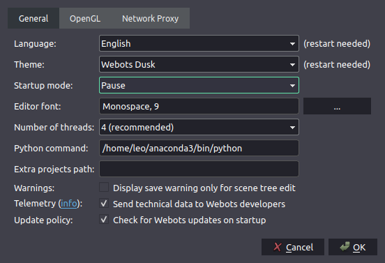
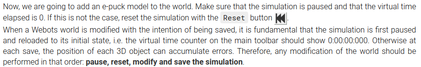
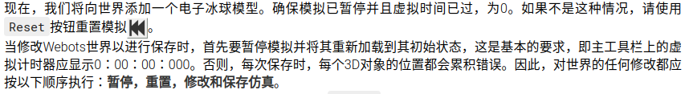
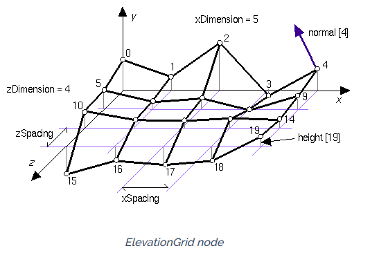
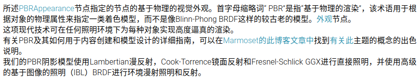
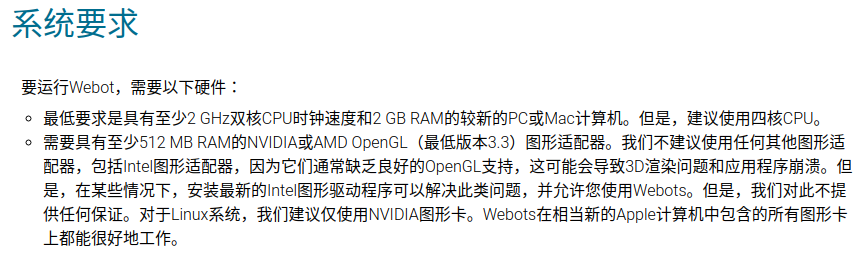
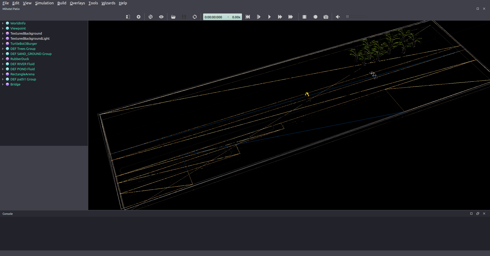

此处主要是官方文档指路. (因为偷懒下面摘自官方文档的中文是谷歌机翻)

❗️ 据我观察webots从最开始到现在变化较大, 发布时间较早的教程参考价值不那么大. 说实话我觉得webots还很不成熟, [甚至控制台的ANSI字符串输出支持都是刚刚才加上的](https://github.com/cyberbotics/webots/pull/1492, 直接导入3D模型的功能也是近期才在做的功能. 可能只是因为他在Windows有较好的支持老师才选的这个吧)

---

1. [文档](#文档)
2. [软件使用](#软件使用)
   1. [语言](#语言)
   2. [查看](#查看)
   3. [建议设置](#建议设置)
   4. [编辑流程](#编辑流程)
   5. [一个标准的webots项目文件结构](#一个标准的webots项目文件结构)
   6. [DEF-USE机制](#DEF-USE机制)
   7. [外部程序调试webots控制器](#外部程序调试webots控制器)
3. [概念说明](#概念说明)
   1. [坐标系](#坐标系)
   2. [节点](#节点)
   3. [外观](#外观)
      1. [创建水体](#创建水体)
   4. [PROTO机制](#PROTO机制)
   5. [ODE](#ODE)
4. [更实际的样例](#更实际的样例)
5. [Troubleshooting](#Troubleshooting)
   1. [为什么闪退了](#为什么闪退了)
   2. [为什么变得只有线了](#为什么变得只有线了)
   3. [为什么机器人沉入地面了](#为什么机器人沉入地面了)
   4. [为什么每次仿真结果不一样](#为什么每次仿真结果不一样)

---

## 文档

我看到的官方文档一共有三处:

- [用户指南](https://cyberbotics.com/doc/guide/index)
- [参考手册](https://cyberbotics.com/doc/reference/index)
- [Webots Wiki](https://github.com/cyberbotics/webots/wiki)

## 软件使用

### 语言

建议直接英文, 这个中文是阉割版的. 只有菜单栏里本来就能看懂的翻译过来了, 真正有点难理解的词并没有翻译... 文档也只有英文的, 如果软件语言中中文有时候可能并不能很快把文档说明和软件里的词对应上.

### 查看

<kbd>Alt</kbd> <kbd>5</kbd>

### 建议设置

🔗 [官方文档偏好设置部分](https://cyberbotics.com/doc/guide/preferences)

- 启动模式建议设置为**Pause**, 这样不会每次打开一个世界就在运行仿真了.
- 如果使用了Python虚拟环境那么要注意在偏好中`Python command`这项设置为你需要的python解释器的路径

### 编辑流程

🔗 [出处](https://cyberbotics.com/doc/guide/tutorial-1-your-first-simulation-in-webots#add-an-e-puck-robot)

### 一个标准的webots项目文件结构

🔗 [官方文档](https://cyberbotics.com/doc/guide/the-standard-file-hierarchy-of-a-project?tab-language=python)

### DEF-USE机制

🔗 [入门教程中的描述](https://cyberbotics.com/doc/guide/tutorial-2-modification-of-the-environment#def-use-mechanism)

🔗 [参考手册中仅有的一点描述](https://cyberbotics.com/doc/reference/def-and-use)

### 外部程序调试webots控制器

🔗 [官方文档配置使用Pycharm调试webots控制器教程](https://cyberbotics.com/doc/guide/using-your-ide?tab-language=python#pycharm) (对VSC同理)

我已经试了可以配置VSC调试webots控制器.

(只是运行的话用终端就可以)

## 概念说明

### 坐标系

值得注意的是在webots中**表示高度的轴为y轴**. 不知道为什么官方文档似乎认为这是常识似的🤦‍♂

> 这是[官方文档ElevationGrid部分](https://cyberbotics.com/doc/reference/elevationgrid)绘制才示意图, 清楚显示了xyz三轴方向.

### 节点

🔗 [官方文档节点从属图](https://cyberbotics.com/doc/reference/node-chart) (这个图里的大部分节点是有超链接的)

> Webots nodes listed in this reference are described using standard VRML97 syntax. Principally, Webots uses a subset of the VRML97 nodes and fields, but it also defines additional nodes and fields specific to robotic definitions. For example, the Webots WorldInfo and Sphere nodes have additional fields with respect to VRML97.

也就是说webots中的节点和VRML97语法的节点是**交叉关系**, webots只支持了一部分VRML97的节点, 域, 同时还有一些自己专有的节点, 域. 这就导致外部导入VRML文件时很容易报一串错...

### 外观

外观节点有`PBRAppearance`和`Appearance`两种.

🔗 [官方文档PBRAppearance部分](https://cyberbotics.com/doc/reference/pbrappearance)

PBRAppearance的PBR指的是**P**hysically-**B**ased **R**endering. 从上面描述能看出PBRAppearance渲染效果必然比Appearance好. [这里](https://cyberbotics.com/doc/guide/tutorial-3-appearance#modify-the-appearance-of-the-walls)是一个Appearance和PBRAppearance的效果对比.

#### 创建水体

🔗 [参考样例: floating_geometries.wbt](https://cyberbotics.com/doc/guide/samples-geometries#floating_geometries-wbt)

### PROTO机制

🔗 [官方文档PROTO部分](https://cyberbotics.com/doc/reference/proto)

官方并没有给出PROTO是什么含义, 不过我猜是**Proto**type, 即原型. PROTO机制允许用户利用webots内置节点和其他PROTO节点轻松创建新的PROTO节点类型.

### ODE

🔗 [ODE: Open Dynamics Engine](https://cyberbotics.com/doc/reference/ode-open-dynamics-engine)

## 更实际的样例

webots在[这里](https://cyberbotics.com/doc/guide/sample-webots-applications)给出了颇为丰富的样例, 包括了各方面. 另外在你的webots安装目录的`project`下有webots的各种可供参考的代码. webots的节点可以直接复制粘贴, 因此看到好用的东西直接抄就是了.

## Troubleshooting

### 为什么闪退了

🔗 [仅使用intel显卡可能导致崩溃](https://cyberbotics.com/doc/guide/general-bugs#intel-graphics-cards)

🔗 [为什么我的机器人/仿真炸了](https://cyberbotics.com/doc/guide/modeling#my-robotsimulation-explodes-what-should-i-do)

🔗 [提高仿真速度](https://cyberbotics.com/doc/guide/speed-performance#how-can-i-change-the-speed-of-the-simulation)

### 为什么变得只有线了

这个是勾选了`View` > `Wireframe Rendering`的效果, 如果选`View` > `Plain Rendering`就回到熟悉的感觉了.

### 为什么机器人沉入地面了

🔗 [My Robot Sinks into the Ground, How to Remove This Effect?](https://cyberbotics.com/doc/guide/modeling#my-robot-sinks-into-the-ground-how-to-remove-this-effect)

### 为什么每次仿真结果不一样

🔗 [How to Make Replicable/Deterministic Simulations?](https://cyberbotics.com/doc/guide/modeling#how-to-make-replicabledeterministic-simulations)

