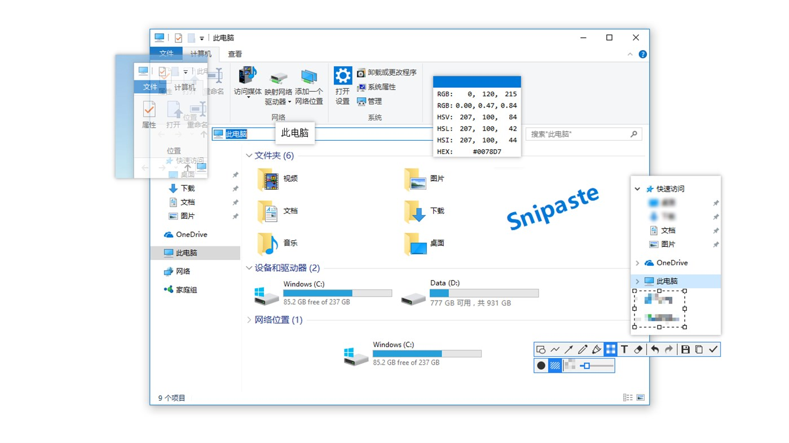

1. [Windows软件](#Windows软件)
   1. [全局文件搜索工具](#全局文件搜索工具)
   2. [截图/贴图工具](#截图贴图工具)
2. [chrome插件](#chrome插件)
   1. [查词工具](#查词工具)
   2. [GitHub相关](#GitHub相关)

## Windows软件

### 全局文件搜索工具

🔗 [**Everything**](https://www.voidtools.com/zh-cn/) 这款搜索工具让搜索变得十分迅速. 它甚至支持正则搜索等更高级的功能.

💡 Everything安装起来也很容易, 下载上面链接中的**安装版64位**, 安装引导中除了安装位置都维持默认选项即可.

### 截图/贴图工具

我们都知道Windows自带的截图工具是很不好用的, 只能进行最简单的截图.

这里推荐🔗
[**snipaste**](https://www.microsoft.com/zh-cn/p/snipaste/9p1wxpkb68kx?activetab=pivot:overviewtab).
snipaste不仅能截图, 还能简单的P一下截下来的图: 画线, 画框, 画箭头, 打码, 查看像素点颜色值…

而我觉得snipaste最惊艳的功能是他还能**贴图**, 也就是能把刚截的图直接显示出来, 可以挪动, 调整大小, 调整透明度. 比如当我们想对照着看课文里两个相隔很多页的段落时, 我们可以把其中一段截图并贴出来.

## chrome插件

### 查词工具

🔗 [**沙拉查词**](https://chrome.google.com/webstore/detail/沙拉查词-聚合词典划词翻译/cdonnmffkdaoajfknoeeecmchibpmkmg?hl=en)
是一款查词十分迅速便利, 弹出界面十分养眼, 可选功能很多的查词工具, 是chrome查词插件中毫无疑问最好的!

### GitHub相关

#### 侧边栏显示仓库文件树

在GitHub上想找一个文件只能一层一层文件夹点进去是一件令人十分苦恼的事, 而🔗
[**Octotree**](https://chrome.google.com/webstore/detail/octotree/bkhaagjahfmjljalopjnoealnfndnagc)
能让我们**像使用IDE一样**在侧边栏看到文件树, 甚至是带图标的

#### 3D GitHub贡献热力图

🔗 [**Isometric Contributions**](https://chrome.google.com/webstore/detail/isometric-contributions/mjoedlfflcchnleknnceiplgaeoegien)
纯碎是一个美化GitHub个人主页的贡献热力图的插件. 它会将**Github Contributions Graph**呈现为
**3D的柱状图**. 非常炫酷😎

